# InsightFlow — Production Architecture

## System Context

InsightFlow is a multi-tenant AI data analytics platform. Users upload datasets (CSV, Excel, PDF), run natural-language analytics, generate dashboards, and get AI-powered intelligence. The system serves law-enforcement KAVACH modules alongside general InsightFlow analytics from a single backend.

```
                    ┌──────────────────────────────────────────────────┐
                    │                   Users                          │
                    │      Browser · Mobile · API Clients              │
                    └────────┬─────────┬──────────┬───────────────────┘
                             │         │          │
                    ┌────────▼─────────▼──────────▼───────────────────┐
                    │                 CDN (CloudFront / Cloudflare)    │
                    │         Static assets · Edge caching            │
                    └────────────────────┬────────────────────────────┘
                                         │
                    ┌────────────────────▼────────────────────────────┐
                    │              API Gateway                        │
                    │   Rate limit · Auth · WAF · Request validation  │
                    │   TLS termination · IP allowlist                │
                    └────┬───────────┬──────────┬─────────────────────┘
                         │           │          │
              ┌──────────▼──┐  ┌─────▼──────┐  └──────────┐
              │  Frontend   │  │  Backend   │             │
              │  React SPA  │  │  Hono API  │             │
              │  shadcn/ui  │  │  + Zod     │             │
              └─────────────┘  └─────┬──────┘             │
                                     │                    │
              ┌──────────────────────▼─────────────────────▼──────┐
              │                   Service Mesh                     │
              │            mTLS · Retry · Circuit breaker          │
              └────┬────────────┬───────────┬──────────┬──────────┘
                   │            │           │          │
          ┌────────▼──┐  ┌─────▼──────┐  ┌─▼───────┐  ┌▼──────────┐
          │ PostgreSQL│  │   Redis    │  │  Qdrant  │  │  FastAPI  │
          │ + PostGIS │  │ Cache/Queue│  │ pgvector │  │  ML Service│
          │ + pgvector│  │            │  │ (opt.)   │  │           │
          └───────────┘  └────────────┘  └──────────┘  └───────────┘
```

## Architecture Decisions

### 1. API Gateway — Hono

**Decision**: Replace native `http.createServer` with Hono (6 kB, Zod-native).

**Reasoning**:
- The current 33-route manual router is fragile — each new route requires hand-written URL matching, body parsing, and error handling
- Hono gives us typed middleware chains, built-in Zod validation, streaming responses, and CORS management
- 17x faster than Express on req/s, zero dependencies
- Bun-compatible if we migrate runtimes later

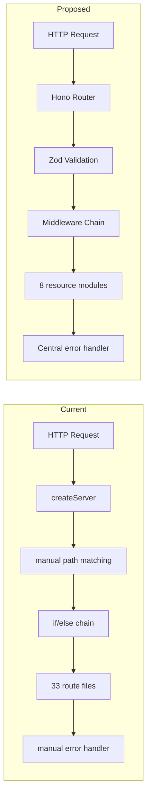

### 2. Authentication — JWT + OAuth2 Bridge

**Decision**: Keep current JWT (jose + bcryptjs) for first-party auth; add OAuth2 Proxy for third-party SSO.

**Reasoning**:
- 17 AI providers means 17 potential API keys in env — these should never touch the frontend
- OAuth2 Proxy (oauth2-proxy/cloudflare-access) sits in front of the gateway, injects `X-Forwarded-User` header
- JWT is service-to-service: backend signs short-lived tokens (15 min), refresh tokens (7 days) stored in httpOnly cookies
- Role-based access: `STATE_ADMIN`, `DATA_ENGINEER`, `AUDITOR`, `ANALYST`

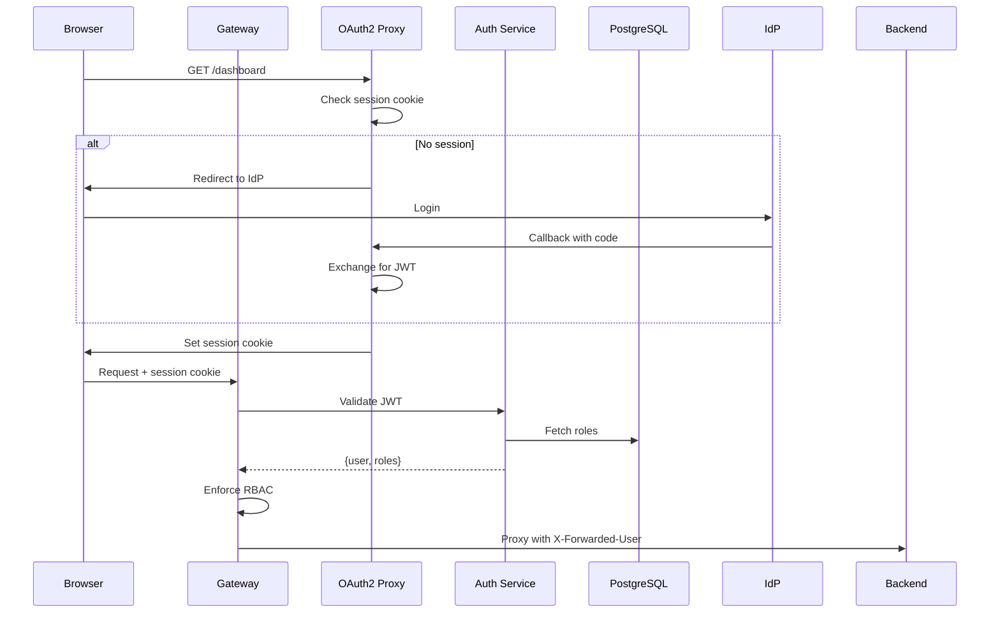

### 3. AI Inference — Unified Provider Gateway

**Decision**: Abstract all 17 AI providers behind a single Hono route with Zod schema, streaming, and queue-backed execution.

**Reasoning**:
- Current ai-router.js does provider selection, response scoring, fallback cascading, and payload sanitization inline — this is correct but blocks the request thread
- Every AI call goes through: validate → enqueue (BullMQ) → route to provider → stream response → score → return
- Streaming via SSE: `/api/ai/chat?stream=true` returns `text/event-stream`, frontend reads with `EventSource`
- Provider priority: `GEMINI → ANTHROPIC → OPENAI → OLLAMA → local NLP` (configurable)

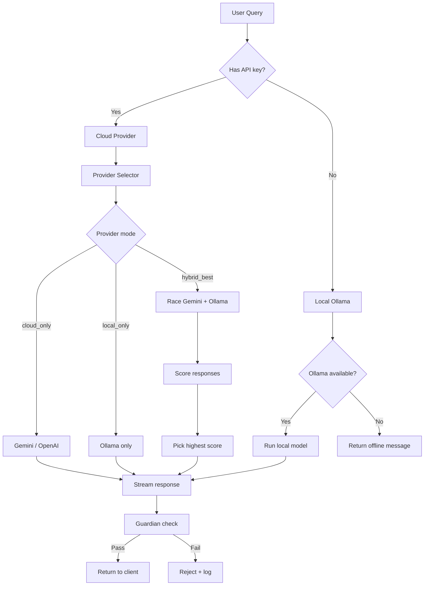

### 4. Vector Database — pgvector

**Decision**: Use pgvector on PostgreSQL instead of a separate Qdrant cluster.

**Reasoning**:
- Current setup already has PostgreSQL + PostGIS — adding pgvector is `CREATE EXTENSION vector;` — no new infrastructure
- Qdrant is optional and currently defaults to disabled with JSON fallback, meaning vector search is not reliable in production today
- pgvector gives us: ACID-compliant vectors, same backup/restore as the rest of data, no network hop, PostGIS + vector in one query for geo-similarity
- HNSW index for approximate nearest neighbor search at <50 ms recall at 100k vectors
- Separate Qdrant cluster only justified at >1M vectors — unnecessary at current scale

```mermaid
erDiagram
    DATASET {
        uuid id PK
        text name
        text source_type
        timestamp created_at
    }
    
    SCHEMA_MEMORY {
        uuid id PK
        uuid dataset_id FK
        vector embedding 1536
        text field_name
        text field_type
    }
    
    PDF_CHUNK {
        uuid id PK
        uuid dataset_id FK
        vector embedding 1536
        text content
        int chunk_index
        text page_ref
    }
    
    DATASET ||--o{ SCHEMA_MEMORY : has
    DATASET ||--o{ PDF_CHUNK : has
```

### 5. Embedding Pipeline

**Decision**: Async document processing pipeline with BullMQ.

**Reasoning**:
- PDF upload → chunk → embed → store should never block the upload response
- BullMQ + Redis gives retry with exponential backoff, dead-letter queue for failed embeddings, progress tracking
- Embedding model: `nomic-embed-text` via Ollama (local) or `text-embedding-3-small` via OpenAI (cloud)
- Chunking strategy: recursive character split, 512 tokens with 128 token overlap

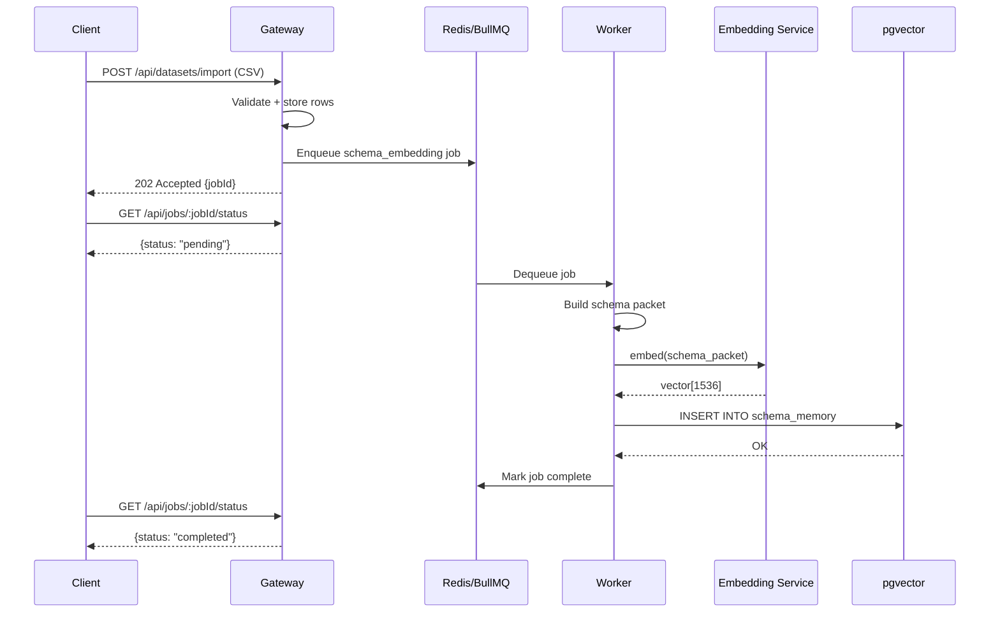

### 6. Model Serving

**Decision**: Two-tier model serving — cloud APIs for latency-sensitive, local Ollama/vLLM for offline/air-gapped.

**Reasoning**:
- Cloud (Gemini, OpenAI, Anthropic): zero GPU cost, best accuracy, pay-per-token, <2 s TTFT
- Local (Ollama): air-gapped KAVACH deployments, no data leaves premises, runs on CPU/GPU
- Fine-tuned models: served via vLLM with LoRA adapters, OpenAI-compatible API endpoint
- Model routing uses task-type mapping from current model-router.js but adds circuit-breaker pattern

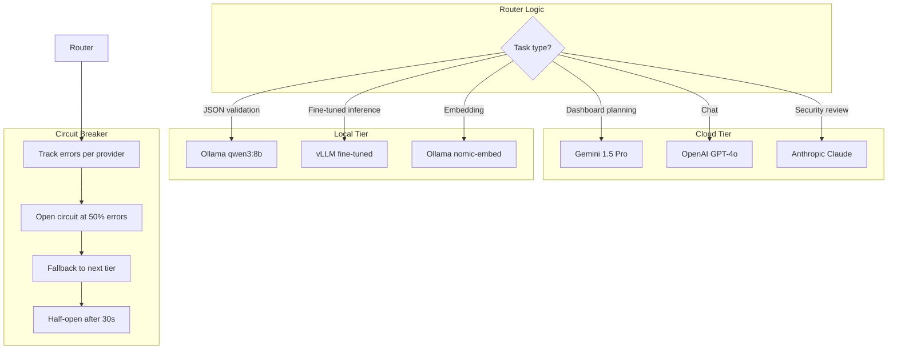

### 7. Cache — Redis

**Decision**: Redis for three distinct concerns: BullMQ queue, response cache, session store.

**Reasoning**:
- AI responses are deterministic for identical schema+query pairs — cache TTL 5 min saves 40-60% of AI costs
- BullMQ needs Redis for job persistence
- Session store moves from memory to Redis — survives restarts, scales across pods
- Redis Stack includes RedisJSON and RediSearch for structured caching

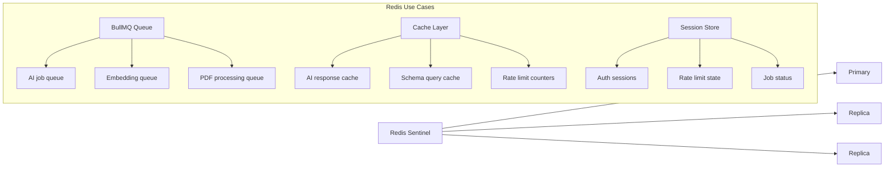

### 8. Database — PostgreSQL 16 + PostGIS + pgvector

**Decision**: Single PostgreSQL instance with extensions.

**Reasoning**:
- Already using `postgis/postgis:16-3.4` — add `pgvector` via `CREATE EXTENSION vector`
- Connection pooling via PgBouncer (sidecar) — handles burst traffic without overwhelming PG
- Read replicas for analytics queries — dashboard queries go to replica, writes go to primary
- Partitioning: `datasets` partitioned by `created_at` month, `schema_memory` by `dataset_id` hash

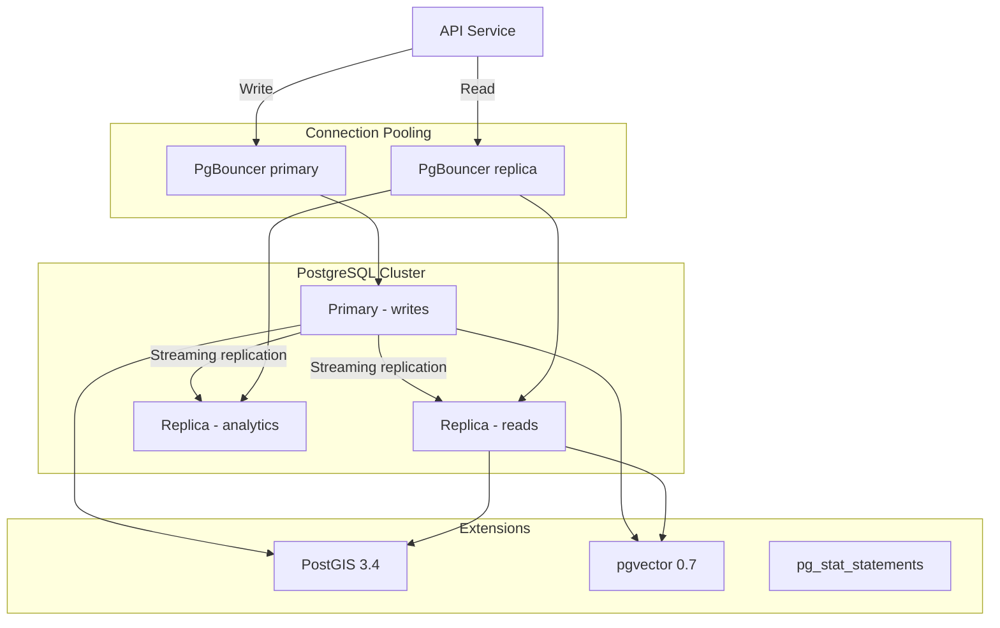

### 9. Monitoring — Prometheus + OpenTelemetry

**Decision**: OpenTelemetry for traces + Prometheus for metrics + Grafana for dashboards.

**Reasoning**:
- AI calls are the most expensive and failure-prone path — need per-provider latency histograms, error rates, token consumption
- OpenTelemetry auto-instruments Hono routes, pg queries, BullMQ jobs, AI provider HTTP calls
- RED metrics: Rate (requests/s), Errors (%), Duration (p50/p95/p99)
- USE metrics for infrastructure: Utilization, Saturation, Errors for CPU, memory, connections

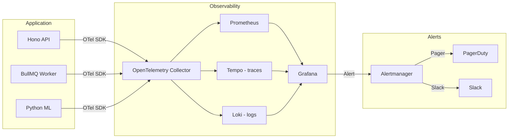

### 10. Logging — Structured JSON

**Decision**: All services emit newline-delimited JSON to stdout; Loki collects; Grafana dashboards.

**Reasoning**:
- Current backend uses `console.log` with emoji prefixes — unparseable in production
- Structured JSON: `{"level":"info","service":"backend","requestId":"...","duration":42,"provider":"gemini","tokens":1500}`
- Correlation ID (`X-Request-Id`) threads through API Gateway → backend → AI provider → database
- AI audit log (separate PostgreSQL table): every prompt + response + provider used + tokens consumed + latency

### 11. CI/CD — GitHub Actions

**Decision**: Monorepo pipeline with dependency caching, parallel test matrix, and selective deployment.

**Reasoning**:
- npm workspaces monorepo — change in `packages/shared-analytics` should not rebuild `apps/ml-service`
- Turborepo remote caching for build artifacts
- Test matrix: frontend tests (Vitest), backend tests (Vitest), Python tests (pytest), E2E (Playwright)
- Docker images built only on main branch merge
- Zoho Catalyst deploy via Catalyst CLI in final stage

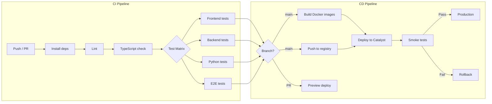

### 12. Docker — Multi-stage builds

```dockerfile
# Frontend
FROM node:22-alpine AS frontend-build
WORKDIR /app
COPY package.json ./
RUN npm ci
COPY . .
RUN npm run build

# Backend
FROM node:22-alpine AS backend-build
WORKDIR /app
COPY package.json ./
RUN npm ci --production
COPY . .

# ML Service
FROM python:3.12-slim AS ml-build
WORKDIR /app
COPY requirements.txt .
RUN pip install --no-cache-dir -r requirements.txt
COPY . .

# Production image
FROM node:22-alpine
RUN apk add --no-cache curl
COPY --from=frontend-build /app/apps/frontend/dist /app/public
COPY --from=backend-build /app/apps/backend /app/backend
COPY --from=ml-build /app/apps/ml-service /app/ml-service
EXPOSE 3001
HEALTHCHECK --interval=30s --timeout=3s \
  CMD curl -f http://localhost:3001/api/health || exit 1
CMD ["node", "/app/backend/src/index.js"]
```

### 13. Kubernetes / Zoho Catalyst

**Decision**: Design for Catalyst's container platform (Catalyst AppSail) but keep manifests K8s-compatible.

**Reasoning**:
- Catalyst AppSail runs containers — standard Docker images deploy with zero modification
- Catalyst does not provide native K8s API — use Catalyst YAML for deployment, not Helm
- Resource requests/limits, health checks, and environment variables map 1:1
- For non-Catalyst deployments: same Docker images deploy to any K8s cluster

```yaml
# catalyst-appsail.yaml
services:
  - name: insightflow-api
    image: insightflow/api:latest
    port: 3001
    cpu: 1
    memory: 2Gi
    min_instances: 2
    max_instances: 10
    health_check:
      path: /api/health
      interval: 30s
    env:
      - REDIS_URL: redis://redis-service:6379
      - DATABASE_URL: postgresql://...
```

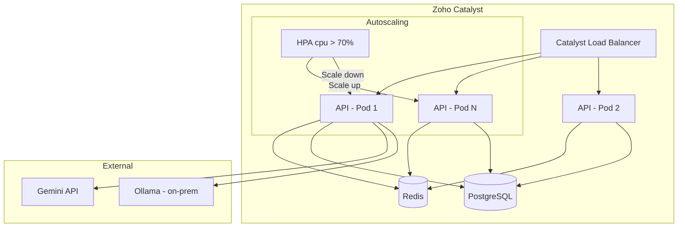

### 14. Security

| Layer | Control | Implementation |
|---|---|---|
| **Network** | WAF + DDoS | Cloudflare / Catalyst WAF |
| **Transport** | TLS 1.3 | Auto-terminated at gateway |
| **Auth** | JWT + OAuth2 Proxy | jose + oauth2-proxy |
| **API** | Rate limiting | Redis sliding window: 10 rpm/user |
| **Input** | Zod validation | All endpoints validated |
| **AI** | Prompt guard | Payload sanitizer: no raw rows |
| **Secrets** | Vault / env | Never in code, mounted as env |
| **DB** | Encrypted at rest | RDS/Kubernetes secret encryption |
| **Audit** | AI audit log | Every prompt+response stored |
| **CORS** | Origin allowlist | Per-environment strict origins |

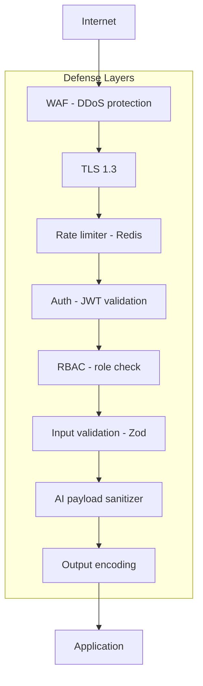

### 15. Scaling

| Dimension | Strategy | Trigger |
|---|---|---|
| **API pods** | Horizontal autoscaling | CPU > 70%, memory > 80% |
| **AI queue workers** | Separate worker pool | Queue depth > 100 |
| **Database** | Read replicas | Connection pool > 80% |
| **Vector search** | HNSW index parameters | Recall < 95% at 100k+ vectors |
| **Static assets** | CDN caching | Cache hit rate < 90% |
| **Sessions** | Redis cluster | Memory > 75% |

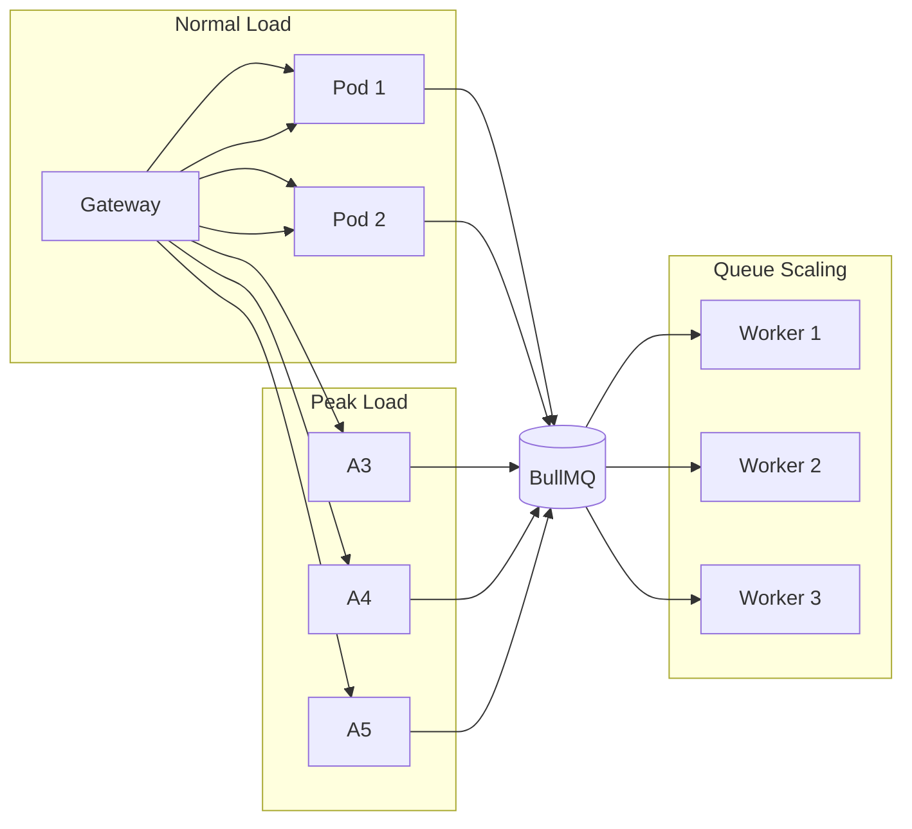

### 16. Backup & Disaster Recovery

**Decision**: PostgreSQL pg_dump + WAL archiving + cross-region recovery.

**Reasoning**:
- PostgreSQL is the single source of truth — losing it loses datasets, schema memory, user data
- pg_dump nightly → compressed → S3-compatible storage (Catalyst Filestore)
- WAL archiving every 5 min → point-in-time recovery to any second
- Redis is ephemeral — RDB snapshots every hour for warm-start after crash

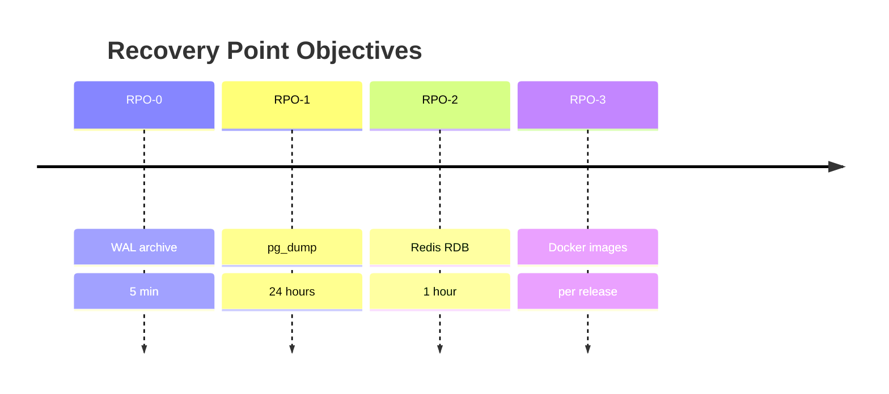

| Scenario | RTO | RPO | Recovery Action |
|---|---|---|---|
| Pod crash | <10 s | 0 | K8s/Catalyst restart |
| AZ outage | <5 min | 5 min | Promote replica in secondary AZ |
| DB corruption | <30 min | 24 h | Restore last pg_dump + WAL replay |
| Full region failure | <2 h | 24 h | Cross-region restore from S3 backup |
| Accidental data deletion | <1 h | 5 min | PITR to timestamp before deletion |
| Secrets compromise | <15 min | 0 | Rotate all keys, restart pods |

### 17. Resource Budgets

| Service | CPU | Memory | Storage | Instances (min/max) |
|---|---|---|---|---|
| API Gateway (Hono) | 1 core | 1 GB | — | 2 / 10 |
| BullMQ Worker | 1 core | 2 GB | — | 1 / 5 |
| PostgreSQL | 4 cores | 8 GB | 100 GB SSD | 1 primary + 2 replicas |
| Redis | 2 cores | 4 GB | 20 GB | 1 primary + 2 replicas |
| ML Service (FastAPI) | 2 cores | 4 GB | — | 1 / 3 |
| Qdrant (optional) | 2 cores | 4 GB | 50 GB SSD | 1 / 2 |

Monthly cost estimate (Zoho Catalyst / equivalent cloud): **$200-400/mo** at low load, **$800-1500/mo** at production scale with 17 AI provider API costs separate.

### 18. Deployment Architecture Diagram — Full System

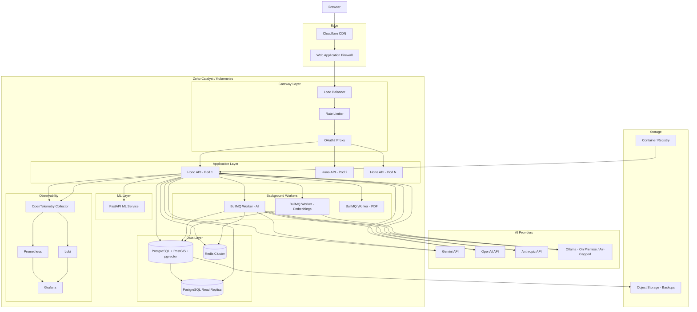

## Migration Path

```
Week 1     Week 2     Week 3     Week 4     Week 5
├──────────┼──────────┼──────────┼──────────┼──────────┤
│ Hono     │ BullMQ   │ pgvector │ Redis    │ Monitoring│
│ framework│ queue    │ migration│ cache    │ & logging │
│ Zod      │ workers  │          │ sessions │          │
├──────────┼──────────┼──────────┼──────────┼──────────┤
│ 33 → 8   │ Async AI │ Vector   │ AI resp. │ OTel +   │
│ route    │ calls    │ search   │ cache    │ Grafana  │
│ modules  │          │          │          │ dashboards│
└──────────┴──────────┴──────────┴──────────┴──────────┘
```

Each week is deployable independently. No big-bang migration.

## Key Metrics to Track

| Metric | Target | Why |
|---|---|---|
| AI p95 latency | <5 s | Users wait for AI responses |
| AI success rate | >99% | Provider fallbacks must work |
| Vector search p95 | <100 ms | Dashboard queries read vectors |
| API error rate | <0.1% | Production SLA |
| Cache hit rate | >40% | Reduces AI costs |
| DB connection pool | <80% utilization | Prevents connection exhaustion |
| Queue backlog | <100 jobs | AI workers must keep up |
| p99 response time | <500 ms (non-AI) | General API responsiveness |
